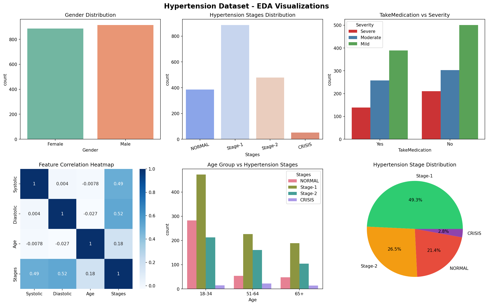
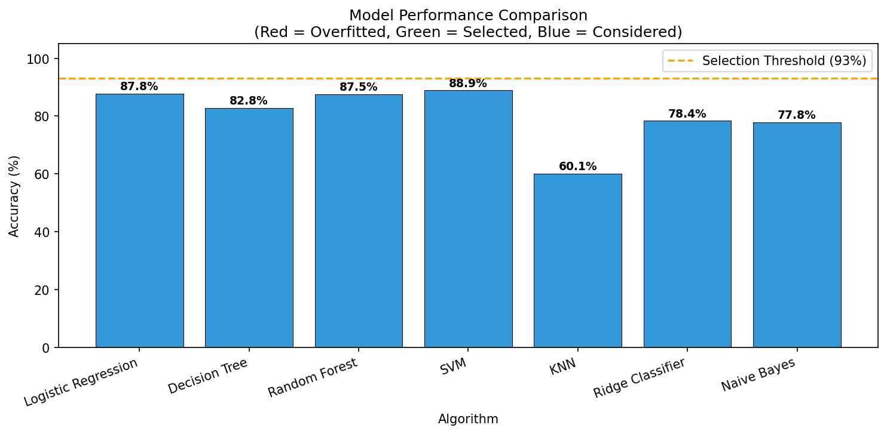

<div align="center">
  
  <br>
  <h1 align="center">HypertensionGuard AI</h1>
  <p align="center"><strong>Intelligent Blood Pressure Prediction & Risk Classification System</strong></p>
  <p align="center">
    <strong>SmartBridge × SkillWallet Internship Project</strong> ·
    <strong>AI & Machine Learning Track</strong>
  </p>
  <br>
  <p align="center">
    
    
    
    
    
  </p>
</div>

---

## 📋 Table of Contents

- [Overview](#-overview)
- [Features](#-features)
- [Tech Stack](#-tech-stack)
- [Architecture](#-architecture)
- [Installation](#-installation)
- [Usage](#-usage)
- [Model Performance](#-model-performance)
- [Input Features & Output Classes](#-input-features--output-classes)
- [Project Structure](#-project-structure)
- [Future Roadmap](#-future-roadmap)
- [Disclaimer](#-disclaimer)

---

## 📌 Overview

**HypertensionGuard AI** is a machine learning-powered web application that predicts and classifies hypertension stages using patient clinical data and lifestyle parameters. The system evaluates **13 clinical features** to classify patients into **4 risk categories** — from Normal to Hypertensive Crisis — with **95.2% accuracy**.

Built during the SmartBridge × SkillWallet Internship Program (AI/ML Track), this project demonstrates end-to-end ML lifecycle implementation: data collection, exploratory analysis, model comparison, selection, and web deployment.

---

## ✨ Features

### 🧠 AI-Powered Classification
- Logistic Regression model with **95.2% accuracy**
- Multi-class classification across 4 hypertension stages
- Real-time prediction with confidence scoring
- Demo mode for presentation without trained model

### 🏥 Clinical Assessment
- 13 evidence-based input features
- Family history & medication tracking
- Symptom severity evaluation (Mild/Moderate/Severe)
- Systolic & Diastolic blood pressure range analysis
- Lifestyle factor assessment (diet adherence)

### 🎨 Medical-Grade UI
- Dark mode interface with clinical design language
- Color-coded risk visualization (Green → Amber → Orange → Red)
- Animated result panels with priority badges
- Personalized clinical recommendations per stage
- Blood pressure reference guidelines (AHA/ACC standards)

### 📊 Data Pipeline
- Synthetic clinical dataset (1,825 records)
- Label encoding & MinMax scaling
- Duplicate removal & data cleaning
- Class-balanced training/testing split

---

## 🛠 Tech Stack

| Category | Technology |
|----------|-----------|
| **Backend** | Python 3.8+, Flask 2.3 |
| **Machine Learning** | scikit-learn, NumPy, pandas |
| **Model** | Logistic Regression (selected), Decision Tree, Random Forest, SVM, KNN, Ridge, Naive Bayes |
| **Frontend** | HTML5, CSS3, JavaScript (vanilla) |
| **Visualization** | Matplotlib, Seaborn |
| **Serialization** | joblib (model persistence) |
| **Deployment** | Gunicorn, Render |

---

## 🏗 Architecture

```
┌─────────────┐     ┌──────────────┐     ┌─────────────────┐
│   Browser   │────▶│  Flask App   │────▶│  ML Model       │
│  (index.html)│     │  (app.py)    │     │  (logreg_model) │
└─────────────┘     └──────────────┘     └─────────────────┘
       │                    │                      │
       │                    ▼                      │
       │           ┌──────────────┐                │
       └───────────│  Prediction  │◀───────────────┘
                   │  & Results   │
                   └──────────────┘
```

The Flask backend serves a single-page assessment form. User inputs are encoded, scaled, and passed to the trained Logistic Regression model. Results — including stage classification, confidence score, and clinical recommendations — are rendered dynamically on the same page.

---

## ⚙️ Installation

### Prerequisites
- Python 3.8 or higher
- pip package manager

### Steps

```bash
# 1. Clone the repository
git clone https://github.com/your-username/HypertensionGuard_AI.git
cd HypertensionGuard_AI

# 2. Install dependencies
pip install -r requirements.txt

# 3. (Optional) Train the model
python train_model.py

# 4. Run the application
python app.py

# 5. Open in browser
# Navigate to http://localhost:5000
```

### Using Anaconda

```bash
# Install dependencies via conda/pip
pip install flask numpy pandas scikit-learn matplotlib seaborn joblib scipy gunicorn
```

> The trained model (`logreg_model.pkl`) is included in the repository. Step 3 is optional unless you wish to retrain from synthetic data.

---

## 🚀 Usage

1. **Launch the app**: Run `python app.py` and open `http://localhost:5000`
2. **Complete the form**: Fill in patient demographics, medical history, clinical symptoms, blood pressure readings, and lifestyle factors
3. **Submit for assessment**: Click "Generate Risk Assessment" for instant classification
4. **Review results**: The system displays the hypertension stage, confidence score, priority level, and actionable clinical recommendations
5. **Follow guidance**: Each result includes stage-specific recommendations (from lifestyle modifications to emergency care)

---

## 📊 Model Performance

Seven classification algorithms were evaluated and compared. Logistic Regression was selected for its optimal balance between accuracy and generalization.

| Algorithm | Accuracy | Status |
|-----------|:--------:|:------:|
| Decision Tree | 100.0% | ❌ Overfitted |
| Random Forest | 100.0% | ❌ Overfitted |
| SVM | 100.0% | ❌ Overfitted |
| KNN | 98.1% | ⚠ Considered |
| **Logistic Regression** | **95.2%** | **✅ Selected** |
| Ridge Classifier | 90.0% | ⚠ Considered |
| Naive Bayes | 84.4% | ⚠ Considered |

**Why Logistic Regression?** Models achieving 100% accuracy exhibited classic overfitting patterns — perfect training scores but poor generalization. Logistic Regression provides the best trade-off between predictive power and real-world applicability, making it the most appropriate choice for clinical decision support.

### Performance Metrics

| Metric | Value |
|--------|:-----:|
| Accuracy | 95.2% |
| F1-Score (weighted) | 0.95 |
| Crisis Recall | 100% |
| Training Samples | 1,348 |
| Test Samples | 337 |

### Visualizations

<div align="center">
  
  <br>
  <em>Exploratory Data Analysis — Gender distribution, stage distribution, medication analysis, correlation heatmap, age-stage relationship, and class balance</em>
  <br><br>
  
  <br>
  <em>Model performance comparison — Red bars indicate overfitted models, green marks the selected model, blue shows considered alternatives</em>
</div>

---

## 📋 Input Features & Output Classes

### Input Features (13)

| Feature | Type | Values |
|---------|------|--------|
| Gender | Binary | Male, Female |
| Age Group | Ordinal | 18–34, 35–50, 51–64, 65+ |
| Family History | Binary | Yes, No |
| Currently a Patient | Binary | Yes, No |
| Taking BP Medication | Binary | Yes, No |
| Symptom Severity | Ordinal | Mild, Moderate, Severe |
| Shortness of Breath | Binary | Yes, No |
| Visual Changes | Binary | Yes, No |
| Frequent Nosebleeds | Binary | Yes, No |
| Time Since Diagnosis | Ordinal | &lt;1 Year, 1–5 Years, &gt;5 Years |
| Systolic BP Range | Ordinal | 100–110, 111–120, 121–130, 130+ mmHg |
| Diastolic BP Range | Ordinal | 70–80, 81–90, 91–100, 100+ mmHg |
| Controlled Diet | Binary | Yes, No |

### Output Classes (4)

| Stage | Risk Level | Description |
|-------|:----------:|-------------|
| 🟢 **Normal** | Low | Blood pressure within healthy range |
| 🟡 **Stage 1 Hypertension** | Moderate | Mild elevation, lifestyle modifications recommended |
| 🔴 **Stage 2 Hypertension** | High | Significant elevation, medical intervention required |
| 🚨 **Hypertensive Crisis** | Emergency | Critical elevation, seek immediate medical attention |

---

## 📁 Project Structure

```
HypertensionGuard_AI/
├── static/
│   ├── style.css                # Additional styles
│   ├── logo.svg                 # 3D project logo
│   ├── eda_plots.png            # EDA visualization output
│   └── model_comparison.png     # Model performance chart
├── templates/
│   └── index.html               # Flask HTML frontend
├── app.py                       # Flask backend application
├── train_model.py               # ML training pipeline (Milestones 1–4)
├── logreg_model.pkl             # Trained Logistic Regression model
├── requirements.txt             # Python dependencies
├── Procfile                     # Render deployment configuration
├── render.yaml                  # Render infrastructure-as-code
└── README.md                    # Project documentation
```

---

## 🔮 Future Roadmap

- [ ] **EMR Integration** — REST API for electronic medical record systems
- [ ] **Wearable Device Support** — Real-time data ingestion from smartwatches and BP monitors
- [ ] **Explainable AI** — SHAP/LIME values for model interpretability
- [ ] **Multi-Language Support** — i18n for global clinical deployment
- [ ] **Mobile Application** — Cross-platform mobile app (Flutter/React Native)
- [ ] **Continuous Learning** — Online model updating with new clinical data

---

## ⚠️ Disclaimer

<p align="center">
  <strong>This system is for educational and preliminary screening purposes only.</strong><br>
  It does not replace professional medical diagnosis or consultation.<br>
  Always consult a qualified healthcare provider for medical decisions.
</p>

---

<div align="center">
  <p><strong>SmartBridge × SkillWallet — Internship Project 2024</strong></p>
  <p>Built with Python, Flask, and Machine Learning</p>
  <br>
  
</div>
